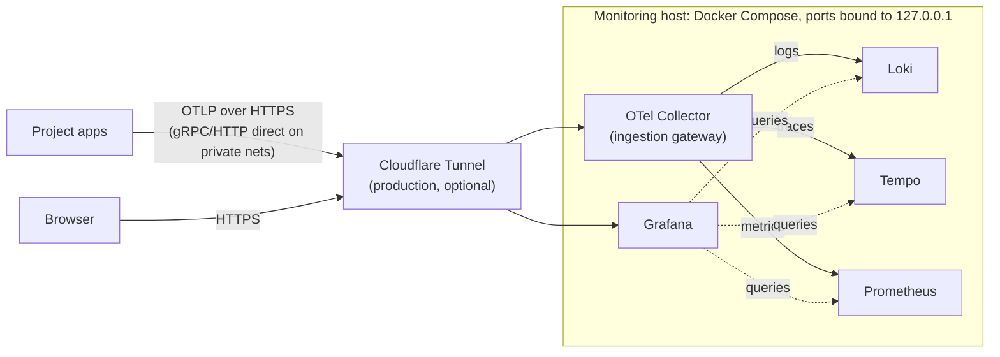

# Observability stack

[](https://github.com/CMLPlatform/monitoring/actions/workflows/ci.yml)
[](config/otel-collector.yaml)
[](compose.yml)
[](LICENSE)

Central monitoring for CML's research software. One host runs Grafana, Loki,
Tempo, Prometheus, and an OpenTelemetry Collector. Projects send logs, traces,
and metrics here over OTLP (the OpenTelemetry protocol), and Grafana shows
them side by side.

## Try it in one command

You need Docker with the [Compose plugin](https://docs.docker.com/compose/install/)
and [`just`](https://github.com/casey/just#installation). Everything else runs
in containers.

```sh
cp .env.example .env
just demo
```

This starts the stack plus a small FastAPI service under constant load
(`compose.demo.yml`). The service is auto-instrumented and fails one request
in ten, so the error panels and the error-rate alert have something to show.
Give it a minute, then open Grafana at <http://localhost:3002>
(admin / change-me):

- **Dashboards → Service Health (RED)**: request rate, error rate, and
  latency. The dots on the latency panel are exemplars. Click one to open the
  trace behind that measurement.
- **Dashboards → Logs**: log volume by service and level, an error feed, and
  a live tail.
- **Alerting → Alert rules**: the rules Grafana evaluates. `HighErrorRate`
  trips on the demo service after five minutes.


`just demo-down` removes the demo services. `just demo-destroy` removes the
whole demo stack.

The demo runs under its own compose project on its own port, so it never
touches a stack already running on the host. The same holds for `just smoke`
on :3001.

## How it works

Everything enters through one gateway, the OpenTelemetry Collector. A project
configures a single endpoint, and a storage backend can be swapped later
without touching any application.



Solid arrows write telemetry. Dotted arrows are Grafana reading at query
time. Locally there is no tunnel, and Grafana is at `localhost:3000` for
`just up` or `localhost:3002` for `just demo`.

The stack runs on a single host. [ADR 0001](docs/adr/0001-observability-stack.md)
records why, and the alternatives. [ADR 0002](docs/adr/0002-hub-and-spoke-observability.md)
describes the hub-and-spoke design that serves multiple projects.

## Run it for real

```sh
cp .env.example .env    # set GRAFANA_ADMIN_PASSWORD
just up
just check              # validate every config in the repo
```

Grafana: <http://localhost:3000>.

`COMPOSE_FILE` in `.env` names the overlays a host runs. In production, set
`COMPOSE_FILE=compose.yml:compose.tunnel.yml`. Every recipe (`up`, `logs`,
`ps`, `backup`) then acts on that set.

With the tunnel overlay active, `just up` refuses to start until five settings
are real: a generated `OTLP_AUTH_TOKEN`, a changed `GRAFANA_ADMIN_PASSWORD`,
`GRAFANA_ROOT_URL` pointing at the tunnel hostname, `GRAFANA_COOKIE_SECURE=true`,
and a non-empty `ALERT_WEBHOOK_URL`. An empty `HEARTBEAT_URL` only warns.

The Cloudflare edge is code too. The tunnel, its hostnames, DNS, and the
Access rule that puts an email one-time PIN in front of Grafana live in
`infra/` as an OpenTofu configuration. Applying it produces the
`CLOUDFLARE_TUNNEL_TOKEN` the overlay needs. The bootstrap steps are at the
top of [infra/main.tf](infra/main.tf).

### Checks

| Recipe | What it does |
| --- | --- |
| `just lint` | Static checks: compose files, rendered alert templates, YAML, workflows, shell, Python, OpenTofu formatting, dashboard JSON, git history for secrets |
| `just validate` | Runs each stack config through the exact image the stack uses |
| `just check` | `lint` plus `validate` |
| `just smoke` | Boots an isolated copy of the stack and asserts it works end to end |
| `just restore-check` | Rehearses backup and restore on the smoke stack |
| `just hooks` | Installs the git hooks: gitleaks at commit, a Conventional Commits check on the message, `check` at push, `infra-validate` at push when `infra/` changed |

Every check runs in a pinned container. Nothing is installed on the host.

`just smoke` covers what has no offline validator. It boots the stack in
production shape with JWT auth on, then asserts that every dashboard and
alert rule provisioned, that the contact points carry the URLs from the
environment, that Grafana refuses a forged token, that every scrape target is
up, and that a metric and a log posted through the collector come back out of
Prometheus and Loki with their labels. `SMOKE_ALERTS=1 just smoke` also stops
a scrape target and waits for `TargetDown` to fire, about three minutes more.
The assertions are in [scripts/smoke.sh](scripts/smoke.sh).

CI runs `lint` on one job and `validate` plus `smoke` (with the alert round
trip) on another, on every pull request.

## Sending telemetry from a project

You need the OTLP endpoint, the bearer token, and a few naming conventions.
[docs/ONBOARDING.md](docs/ONBOARDING.md) has copy-paste templates for
applications. [templates/README.md](templates/README.md) covers the host
agent that ships container logs and host metrics.

> [!WARNING]
> Never publish ports 4317/4318 to the internet. The compose file binds them to
> `127.0.0.1`. The tunnel is the way in.

## Alerting

Grafana evaluates and delivers the rules in `config/grafana/alerting/`:
telemetry silent per project, a project sending telemetry with no rule file,
container crash-looping or OOM-killed, scrape target down, OTel export
failures, alert delivery failing, error rate above 5%, disk above 80%, disk
projected full within 3 days, Prometheus active series above 30k, and 5,000
new series in 30 minutes. There is no Alertmanager. Grafana rules can query Loki as
well as Prometheus, and one engine means one answer to "who gets told".

Notifications go to the webhook in `ALERT_WEBHOOK_URL` (ntfy, Slack, and so
on). One rule, `Watchdog`, fires permanently and posts to `HEARTBEAT_URL`
every five minutes. Point that at a dead man's switch such as healthchecks.io,
which alerts when the pings stop. That is the only way to notice the host
itself dying.

Set both variables. An unset `ALERT_WEBHOOK_URL` drops every alert while the
heartbeat keeps reporting healthy. With the tunnel overlay, `just up` refuses
to start without it.

## Storage

Everything persists to local Docker volumes, captured by `just backup`. The
one exception is `otel_queue`, the collector's on-disk export queue. It holds
seconds of in-flight telemetry and is not worth restoring.

When local disk stops fitting, Loki and Tempo can move to any S3-compatible
object store. The appendix of ADR 0001 documents that change.

## Layout

```sh
compose.yml             # core services
compose.tunnel.yml      # production overlay: Cloudflare Tunnel
compose.demo.yml        # demo overlay: sample telemetry source
compose.sandbox.yml     # isolation overlay for `just demo` and `just smoke`
demo/                   # the demo FastAPI service
scripts/smoke.sh        # what `just smoke` asserts against the booted stack
config/
  otel-collector.yaml   # ingestion gateway (OTLP in → Loki/Tempo/Prometheus out)
  loki.yaml             # logs
  tempo.yaml            # traces
  prometheus.yaml       # metrics
  grafana/              # provisioned datasources, dashboards, and alerting
dashboards/             # JSON dashboards; Grafana loads them from here
docs/                   # runbook, onboarding, ADRs, screenshots
infra/                  # OpenTofu: Cloudflare tunnel, ingress routes, DNS
templates/              # files a project host vendors: agent config, overlays
```

`dashboards/*.json` is the source of truth. The directory is mounted read-only
and UI saves are disabled, so a change made in the browser lasts until the
page reloads. Edit the JSON and provisioning picks it up within 30 seconds. To
keep something built interactively, export it as JSON and paste it into the
file.

## Documentation

| Document | What it covers |
| --- | --- |
| [docs/ONBOARDING.md](docs/ONBOARDING.md) | Connecting an application: endpoint, token, copy-paste templates |
| [templates/README.md](templates/README.md) | Onboarding a project host: the agent, GPU hosts, removing a project |
| [docs/RUNBOOK.md](docs/RUNBOOK.md) | Operations: rotating secrets, disk pressure, backup and restore |
| [docs/adr/](docs/adr/) | Why the stack looks like this |
| [CHANGELOG.md](CHANGELOG.md) | Release history |

Licensed under the [MIT License](LICENSE).
