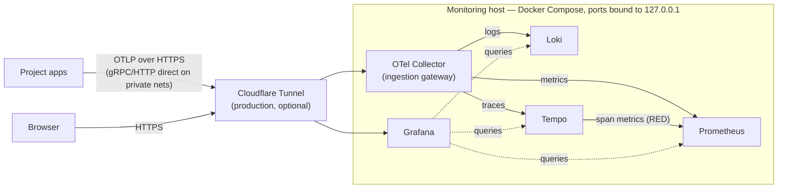

# Observability stack

[](https://github.com/CMLPlatform/monitoring/actions/workflows/ci.yml)
[](config/otel-collector.yaml)
[](compose.yml)
[](LICENSE)

Central monitoring for CML's research software. One host runs Grafana, Loki,
Tempo, Prometheus, and an OpenTelemetry Collector, wired together so logs,
traces, and metrics cross-reference each other. Projects send their telemetry
here over OTLP (the OpenTelemetry protocol) and it lands in one place,
queryable side by side.

## Try it in one command

You need Docker with the [Compose plugin](https://docs.docker.com/compose/install/)
and [`just`](https://github.com/casey/just#installation); everything else runs
in containers.

```sh
cp .env.example .env
just demo
```

This starts the full stack plus a small FastAPI service under constant
artificial load (`compose.demo.yml`). The service is instrumented with
OpenTelemetry auto-instrumentation and fails about one request in ten, on
purpose. Give it a minute, then open Grafana at <http://localhost:3000>
(admin / change-me) and look at:

- **Dashboards → Service Health (RED)** — request rate, error rate, and
  latency. The dots on the latency panel are exemplars: click one and Grafana
  opens the exact trace behind that measurement.
- **Dashboards → Logs Overview** — log volume by service and level, an error
  feed, and a live tail of everything arriving over OTLP.
- **Alerting → Alert rules** — the stack-health and error-rate rules Prometheus
  is evaluating. `HighErrorRate` trips on the demo service after five minutes:
  one request in ten failing is twice the 5% threshold.


`just demo-down` removes the demo services again; the rest of the stack keeps
running.

## How it works

Everything enters through a single gateway, the OpenTelemetry Collector. A
project only ever configures one endpoint, and we can swap a storage backend
later without touching any application. Tempo also derives request-rate,
error-rate, and duration ("RED") metrics from the traces it receives, so a
service that sends nothing but traces still gets a working dashboard and error
alerting.



Solid arrows show telemetry being written; dotted arrows show Grafana reading
at query time. Locally (`just up` or `just demo`) there is no tunnel involved:
everything talks over the compose network and Grafana is at `localhost:3000`.

The stack deliberately runs on a single host. At CML's telemetry volume,
distributed ingestion would add operational weight for no gain. The reasoning,
and the alternatives we considered, are recorded in
[ADR 0001](docs/adr/0001-observability-stack.md).

## Run it for real

```sh
cp .env.example .env    # set GRAFANA_ADMIN_PASSWORD
just up                 # core stack, local only
just up-tunnel          # production: core stack + Cloudflare Tunnel
just check              # validate every config in the repo
```

Grafana: <http://localhost:3000> (admin / whatever you set).

`up-tunnel` refuses to run until the settings that only matter once the stack
is reachable are real: a generated `OTLP_AUTH_TOKEN`, a changed
`GRAFANA_ADMIN_PASSWORD`, `GRAFANA_ROOT_URL` pointing at the tunnel hostname
rather than localhost, and `GRAFANA_COOKIE_SECURE=true` so the session cookie
is marked Secure. An empty `HEARTBEAT_URL` only warns.

In production the stack sits behind a Cloudflare Tunnel, and that edge is code
too. The tunnel, its hostnames, DNS, and the Cloudflare Access rule that puts
an email one-time-PIN in front of Grafana all live in `infra/` as a small
OpenTofu configuration. Applying it produces the `CLOUDFLARE_TUNNEL_TOKEN` that
`just up-tunnel` needs; bootstrap steps are at the top of
[infra/main.tf](infra/main.tf).

`just check` validates compose files, Prometheus config and alert rules, the
collector, Alertmanager, Loki and Tempo configs, YAML, workflows, OpenTofu
formatting, and dashboard JSON. Every validator runs in a pinned container, so
nothing needs to be installed on the host. CI runs the same command on every
push and pull request, plus a smoke test that boots the stack, waits for
Grafana to come up healthy, and checks that every dashboard provisioned.

## Sending telemetry from a project

You need three things: the OTLP endpoint, the bearer token (`OTLP_AUTH_TOKEN`),
and a few naming conventions. Copy-paste templates for each route — zero-code
Python/FastAPI, plain OTLP environment variables, the Loki Docker driver, and
Grafana Alloy for log files — are in
**[docs/ONBOARDING.md](docs/ONBOARDING.md)**.

> [!WARNING]
> Never publish ports 4317/4318 to the internet. The compose file binds them to
> `127.0.0.1`; the tunnel is the way in.

## Alerting

Prometheus evaluates the rules in `config/alerts/`: scrape target down, OTel
export failures, error rate above 5%, disk above 80%. Alertmanager delivers
them to whatever webhook you set in `ALERT_WEBHOOK_URL` (ntfy, Slack, and so
on).

One rule, `Watchdog`, fires permanently by design and posts to `HEARTBEAT_URL`
every five minutes. Point that at a dead man's switch such as healthchecks.io —
a service that alerts when the pings *stop* — and you will also hear about the
one failure the host cannot report itself: its own death. Both variables are
optional; leave them unset and alerts are simply visible in Grafana.

## Storage

Everything persists to local Docker volumes (`loki_data`, `tempo_data`,
`prometheus_data`, `grafana_data`, `alertmanager_data`), all of which `just
backup` captures. A sixth, `otel_queue`, holds the collector's on-disk export
queue — seconds of in-flight telemetry, worthless by the time anyone restores,
so it is deliberately left out. When local disk stops fitting, Loki and
Tempo can move to any S3-compatible object store (Backblaze B2, Cloudflare R2,
Hetzner, MinIO); `compose.storage-s3.yml` documents the concrete shape of that
change.

## Layout

```sh
compose.yml             # core services
compose.tunnel.yml      # production overlay: Cloudflare Tunnel
compose.demo.yml        # demo overlay: sample telemetry source
demo/                   # the demo FastAPI service
config/
  otel-collector.yaml   # ingestion gateway (OTLP in → Loki/Tempo/Prometheus out)
  loki.yaml             # logs
  tempo.yaml            # traces
  prometheus.yaml       # metrics
  alertmanager.yaml     # alert routing (webhook + watchdog heartbeat)
  alerts/               # Prometheus alert rules
  grafana/              # provisioned datasources + dashboard loader
dashboards/             # drop JSON dashboards here; Grafana auto-loads them
docs/                   # runbook, onboarding templates, ADRs, screenshots
infra/                  # OpenTofu: Cloudflare tunnel, ingress routes, DNS
```

`dashboards/*.json` is the source of truth for what Grafana shows: the
directory is mounted read-only and saving from the UI is disabled, so a change
made in the browser lasts until the page is reloaded. Edit the JSON and
provisioning picks it up within about 30 seconds; to keep something built
interactively, export the dashboard as JSON (or copy a single panel's JSON out
of *Inspect → Panel JSON*) and paste it back into the file.

## Documentation

| Document | What it covers |
| --- | --- |
| [docs/ONBOARDING.md](docs/ONBOARDING.md) | Connecting a project: endpoint, token, copy-paste templates |
| [docs/RUNBOOK.md](docs/RUNBOOK.md) | Day-to-day ops: rotating tokens, disk pressure, backup and restore |
| [docs/adr/](docs/adr/) | Why the stack looks like this |
| [CHANGELOG.md](CHANGELOG.md) | Release history |

Licensed under the [MIT License](LICENSE).
