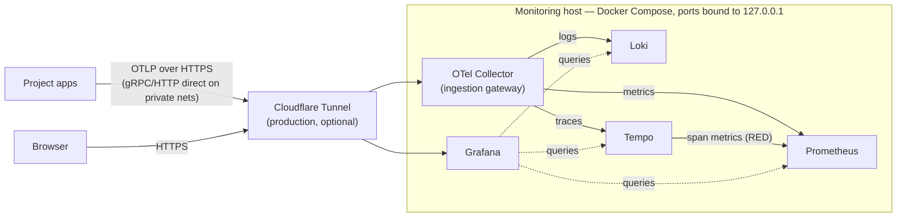

# Observability stack

One host running Grafana, Loki, Tempo, Prometheus, and an OpenTelemetry
Collector, wired so logs, traces, and metrics cross-link. Point any number of
projects at it over OTLP and their telemetry lands in one place.

## Architecture

Everything enters through one gateway — the OTel Collector — so a project
configures a single OTLP endpoint and a backend can be swapped without
touching any app. Tempo derives RED metrics from spans, so a service that
only sends traces still gets dashboards and error alerting. It all runs on
one host on purpose: at CML's telemetry volume, distributed ingest would add
operational weight for no gain. Rationale and alternatives:
[ADR 0001](docs/adr/0001-observability-stack.md).



Solid arrows are the write path; dotted arrows are Grafana reading at query
time. Locally (`just up` / `just demo`) there is no tunnel — everything
talks over the compose network and Grafana is on `localhost:3000`.

## Demo: see it work in one command

```sh
cp .env.example .env
just demo
```

This starts the full stack plus a small auto-instrumented FastAPI service
under constant load (`compose.demo.yml`). Give it a minute, then open
Grafana at <http://localhost:3000> (admin / change-me):

- **Dashboards → Service Health (RED)** — request rate, error rate, and
  latency for the demo service. Latency dots are exemplars: click one to
  open that exact trace in Tempo.
- **Explore → Loki** — `{service_name="demo-api"}`; expand an error line
  and follow its `trace_id` to the trace.
- **Alerting → Alert rules** — stack-health and error-rate rules,
  evaluated by Prometheus.


Tear it down with `just demo-down`.

## Layout

```sh
compose.yml             # core services
compose.tunnel.yml      # production overlay: Cloudflare Tunnel
compose.demo.yml        # demo overlay: sample telemetry source
demo/                   # the demo FastAPI service
config/
  otel-collector.yaml   # ingestion gateway (OTLP in → Loki/Tempo/Prometheus out)
  loki.yaml             # logs
  tempo.yaml            # traces
  prometheus.yaml       # metrics
  alertmanager.yaml     # alert routing (webhook + watchdog heartbeat)
  alerts/               # Prometheus alert rules
  grafana/              # provisioned datasources + dashboard loader
dashboards/             # drop JSON dashboards here; Grafana auto-loads them
docs/                   # runbook, onboarding templates, ADRs, screenshots
infra/                  # OpenTofu: Cloudflare tunnel, ingress routes, DNS
```

## Run

```sh
cp .env.example .env    # set GRAFANA_ADMIN_PASSWORD
just up                 # core stack, local only
just up-tunnel          # core stack + Cloudflare Tunnel (needs CLOUDFLARE_TUNNEL_TOKEN)
```

Grafana: <http://localhost:3000> (admin / whatever you set).

The Cloudflare side of the tunnel (hostnames, DNS, the tunnel itself) is
code too: `infra/` holds a small OpenTofu config whose output is the
`CLOUDFLARE_TUNNEL_TOKEN` the overlay needs — bootstrap instructions in
[infra/main.tf](infra/main.tf).

`just check` validates everything (compose files, Prometheus config and
alert rules, collector config, YAML, workflows, dashboard JSON) in pinned
containers — no host installs. CI runs the same command on every push and
PR, plus a smoke test that boots the stack and waits for Grafana to report
healthy.

## Sending telemetry from a project

One OTLP endpoint (`<host>:4317` gRPC / `:4318` HTTP), bearer-token auth
(`OTLP_AUTH_TOKEN`), and three naming conventions. Copy-paste templates for
every ingestion form — zero-code Python/FastAPI, plain OTLP env vars, the
Loki Docker driver, and Grafana Alloy for file logs — live in
**[docs/ONBOARDING.md](docs/ONBOARDING.md)**.

Never publish 4317/4318 directly; the compose file binds them to
`127.0.0.1` and the tunnel is the exposure path.

## Alerting

Prometheus evaluates the rules in `config/alerts/` (target down, OTel
export failures, >5% span error rate, disk >80%); Alertmanager delivers
them to any webhook via `ALERT_WEBHOOK_URL`, and the always-firing
`Watchdog` posts to `HEARTBEAT_URL` every 5 minutes — point that at a dead
man's switch so you hear about it when the monitoring host itself dies.
Both are optional; unset means alerts are visible in Grafana only.
Operations (rotating tokens, disk pressure, backup/restore):
**[docs/RUNBOOK.md](docs/RUNBOOK.md)**.

## Storage

Everything persists to local Docker volumes (`loki_data`, `tempo_data`,
`prometheus_data`, `grafana_data`). Swap Loki / Tempo storage to S3-compatible
(Backblaze B2, Cloudflare R2, Hetzner, MinIO) when you outgrow local disk —
`compose.storage-s3.yml` documents the concrete shape of that change.
