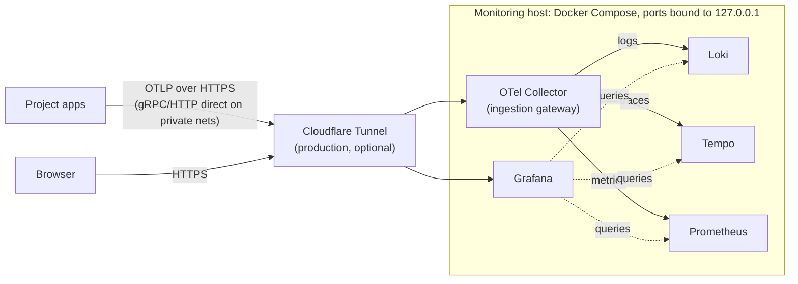

# Observability stack

[](https://github.com/CMLPlatform/monitoring/actions/workflows/ci.yml)
[](config/otel-collector.yaml)
[](compose.yml)
[](LICENSE)

Central monitoring for CML's research software. One host runs Grafana, Loki,
Tempo, Prometheus, and an OpenTelemetry Collector, wired so logs, traces, and
metrics cross-reference each other. Projects send telemetry here over OTLP
(the OpenTelemetry protocol) and it lands in one place, queryable side by
side.

## Try it in one command

You need Docker with the [Compose plugin](https://docs.docker.com/compose/install/)
and [`just`](https://github.com/casey/just#installation); everything else runs
in containers.

```sh
cp .env.example .env
just demo
```

This starts the full stack plus a small FastAPI service under constant
artificial load (`compose.demo.yml`). The service uses OpenTelemetry
auto-instrumentation and fails about one request in ten, which gives the error
panels and the error-rate alert something to show. Give it a minute, then open
Grafana at <http://localhost:3002> (admin / change-me):

- **Dashboards → Service Health (RED)**: request rate, error rate, and
  latency. The dots on the latency panel are exemplars: click one and Grafana
  opens the exact trace behind that measurement.
- **Dashboards → Logs**: log volume by service and level, an error feed, and
  a live tail of everything arriving over OTLP.
- **Alerting → Alert rules**: the stack-health and error-rate rules Grafana
  is evaluating. `HighErrorRate` trips on the demo service after five minutes:
  one request in ten failing is twice the 5% threshold.


`just demo-down` removes the demo services again; the rest of the demo stack
keeps running, and `just demo-destroy` takes the whole thing down.

The demo runs under its own compose project on its own port, so it never joins
or disturbs a stack already running on the host. It is safe to run on the
production box. Same for `just smoke`, on :3001. Override with `DEMO_PORT` /
`SMOKE_PORT`.

## How it works

Everything enters through one gateway, the OpenTelemetry Collector. A project
configures a single endpoint, and a storage backend can be swapped later
without touching any application. The Service Health dashboard
and the error-rate alert read the standard HTTP metrics that OpenTelemetry
auto-instrumentation emits; traces add per-request drill-down on top.



Solid arrows show telemetry being written; dotted arrows show Grafana reading
at query time. Locally there is no tunnel: everything talks over the compose
network, and Grafana is at `localhost:3000` for `just up`, `localhost:3002` for
the isolated `just demo` stack.

The stack runs on a single host. At CML's telemetry volume, distributed
ingestion would add operational weight for no gain
([ADR 0001](docs/adr/0001-observability-stack.md) records the alternatives).
The hub-and-spoke design for serving multiple CML projects is
[ADR 0002](docs/adr/0002-hub-and-spoke-observability.md); onboarding a project
onto it is [templates/README.md](templates/README.md).

## Run it for real

```sh
cp .env.example .env    # set GRAFANA_ADMIN_PASSWORD
just up                 # the stack; overlays come from COMPOSE_FILE in .env
just check              # validate every config in the repo
```

Grafana: <http://localhost:3000> (admin / whatever you set).

`COMPOSE_FILE` in `.env` names the overlays a host runs. Set
`COMPOSE_FILE=compose.yml:compose.tunnel.yml` in the production `.env`, and
every recipe (`up`, `logs`, `ps`, `backup`) acts on that same set.

With the tunnel overlay active, `just up` refuses to run until four settings are
real: a generated `OTLP_AUTH_TOKEN`, a changed `GRAFANA_ADMIN_PASSWORD`,
`GRAFANA_ROOT_URL` pointing at the tunnel hostname, and
`GRAFANA_COOKIE_SECURE=true`. These are the settings that matter once the stack
is reachable. An empty `HEARTBEAT_URL` only warns.

In production the stack sits behind a Cloudflare Tunnel, and that edge is code
too. The tunnel, its hostnames, DNS, and the Cloudflare Access rule that puts
an email one-time-PIN in front of Grafana live in `infra/` as a small OpenTofu
configuration. Applying it produces the `CLOUDFLARE_TUNNEL_TOKEN` the tunnel
overlay needs; bootstrap steps are at the top of
[infra/main.tf](infra/main.tf).

`just check` validates compose files, Prometheus config, the collector, Loki
and Tempo configs, the vendored Alloy config, YAML, workflows, shell scripts,
the demo app's Python, OpenTofu formatting, dashboard JSON, and git history
for leaked secrets.
Every validator runs in a pinned container, so nothing is installed on the
host.

Grafana's alerting provisioning has no offline validator. `just smoke` covers
it: it boots the stack, waits for Grafana to report healthy, and checks that
every dashboard and every alert rule provisioned. It runs under its own compose
project on its own ports, so it cannot disturb a stack already running on the
host. `just smoke` is safe on the production box, and `just smoke-down` cleans
it up. CI runs `just check` and `just smoke` on every push and pull request.

## Sending telemetry from a project

You need the OTLP endpoint, the bearer token (`OTLP_AUTH_TOKEN`), and a few
naming conventions. **[docs/ONBOARDING.md](docs/ONBOARDING.md)** holds
copy-paste templates for the two application routes: zero-code Python/FastAPI,
and plain OTLP environment variables. Everything an application cannot
report about itself comes from the vendored agent in
**[templates/README.md](templates/README.md)**.

> [!WARNING]
> Never publish ports 4317/4318 to the internet. The compose file binds them to
> `127.0.0.1`; the tunnel is the way in.

## Alerting

Grafana both evaluates and delivers, from `config/grafana/alerting/`: telemetry
silent per project, container crash-looping, container OOM-killed, scrape target
down, OTel export failures, alert delivery failing, error rate above 5%, disk
above 80%. Notifications go to whatever webhook you set in `ALERT_WEBHOOK_URL`
(ntfy, Slack, and so on). There is no Alertmanager: Grafana rules can query Loki
as well as Prometheus, and one engine owning both means one answer to "who gets
told".

One rule, `Watchdog`, fires permanently and posts to `HEARTBEAT_URL` every
five minutes. Point that at a dead man's switch such as healthchecks.io, a
service that alerts when the pings *stop*. That covers the one failure the host
cannot report itself: its own death.

Set both variables. An unset `ALERT_WEBHOOK_URL` drops every alert while the
heartbeat keeps reporting healthy, so `just up` with the tunnel overlay refuses
to start without it.

## Storage

Everything persists to local Docker volumes (`loki_data`, `tempo_data`,
`prometheus_data`, `grafana_data`), all captured by `just backup`. Backups skip
a fifth volume, `otel_queue`. It holds the collector's on-disk export queue:
seconds of in-flight telemetry, worthless by the time anyone restores.

When local disk stops fitting, Loki and Tempo can move to any S3-compatible
object store (Backblaze B2, Cloudflare R2, Hetzner, MinIO). The appendix of
ADR 0001 documents that change.

## Layout

```sh
compose.yml             # core services
compose.tunnel.yml      # production overlay: Cloudflare Tunnel
compose.demo.yml        # demo overlay: sample telemetry source
compose.sandbox.yml     # isolation overlay for `just demo` and `just smoke`
demo/                   # the demo FastAPI service
config/
  otel-collector.yaml   # ingestion gateway (OTLP in → Loki/Tempo/Prometheus out)
  loki.yaml             # logs
  tempo.yaml            # traces
  prometheus.yaml       # metrics
  grafana/              # provisioned datasources, dashboards, and alerting
                        #   alerting/ = rules, contact points, routing tree
dashboards/             # drop JSON dashboards here; Grafana auto-loads them
docs/                   # runbook, onboarding templates, ADRs, screenshots
infra/                  # OpenTofu: Cloudflare tunnel, ingress routes, DNS
```

`dashboards/*.json` is the source of truth for what Grafana shows: the
directory is mounted read-only and UI saves are disabled, so a change made in
the browser lasts until the page reloads. Edit the JSON and provisioning picks
it up within about 30 seconds. To keep something built interactively, export
the dashboard as JSON (or copy one panel's JSON from *Inspect → Panel JSON*)
and paste it back into the file.

## Documentation

| Document | What it covers |
| --- | --- |
| [docs/ONBOARDING.md](docs/ONBOARDING.md) | Connecting a project: endpoint, token, copy-paste templates |
| [docs/RUNBOOK.md](docs/RUNBOOK.md) | Day-to-day ops: rotating tokens, disk pressure, backup and restore |
| [docs/adr/](docs/adr/) | Why the stack looks like this |
| [CHANGELOG.md](CHANGELOG.md) | Release history |

Licensed under the [MIT License](LICENSE).
