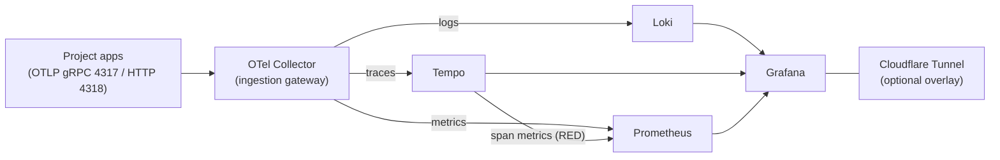
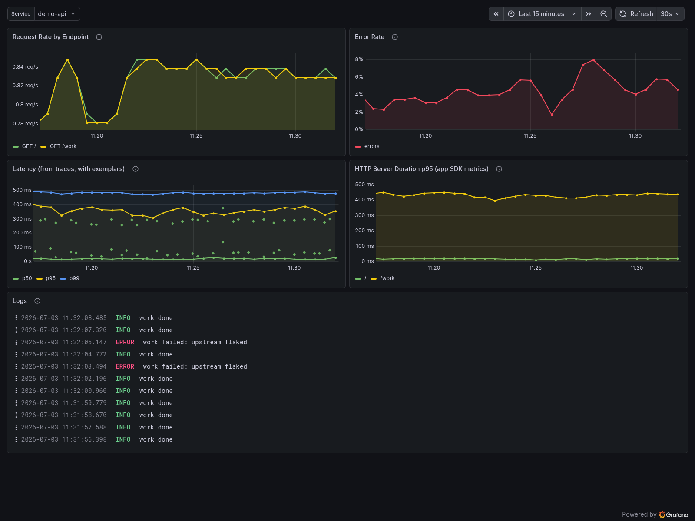

# Observability stack

One host running Grafana, Loki, Tempo, Prometheus, and an OpenTelemetry
Collector, wired so logs, traces, and metrics cross-link. Point any number of
projects at it over OTLP and their telemetry lands in one place.



## Demo: see it work in one command

```sh
cp .env.example .env
just demo
```

This starts the full stack plus a small auto-instrumented FastAPI service
under constant load (`compose.demo.yml`). Give it a minute, then open
Grafana at <http://localhost:3000> (admin / change-me):

- **Dashboards → Service Health (RED)** — request rate, error rate, and
  latency for the demo service. Latency dots are exemplars: click one to
  open that exact trace in Tempo.
- **Explore → Loki** — `{service_name="demo-api"}`; expand an error line
  and follow its `trace_id` to the trace.
- **Alerting → Alert rules** — stack-health and error-rate rules,
  evaluated by Prometheus.



Tear it down with `just demo-down`.

## Layout

```sh
compose.yml             # core services
compose.tunnel.yml      # production overlay: Cloudflare Tunnel
compose.demo.yml        # demo overlay: sample telemetry source
demo/                   # the demo FastAPI service
config/
  otel-collector.yaml   # ingestion gateway (OTLP in → Loki/Tempo/Prometheus out)
  loki.yaml             # logs
  tempo.yaml            # traces
  prometheus.yaml       # metrics
  alerts/               # Prometheus alert rules
  grafana/              # provisioned datasources + dashboard loader
dashboards/             # drop JSON dashboards here; Grafana auto-loads them
```

## Run

```sh
cp .env.example .env    # set GRAFANA_ADMIN_PASSWORD
just up                 # core stack, local only
just up-tunnel          # core stack + Cloudflare Tunnel (needs CLOUDFLARE_TUNNEL_TOKEN)
```

Grafana: <http://localhost:3000> (admin / whatever you set).

`just check` validates everything (compose files, Prometheus config and
alert rules, collector config, YAML, workflows, dashboard JSON) in pinned
containers — no host installs. CI runs the same command on every push and
PR, plus a smoke test that boots the stack and waits for Grafana to report
healthy.

## Sending telemetry from a project

### Traces + metrics (OTLP)

Point your app (or its local OTel Collector) at this host's OTLP endpoints:

- gRPC: `<host>:4317`
- HTTP: `<host>:4318`

Do **not** publish those ports to the public internet. Expose the monitoring
host via Cloudflare Tunnel, Tailscale, or WireGuard — the compose file binds
them to `127.0.0.1` to make that the obvious path.

### Logs (Loki Docker driver)

Container stdout/stderr is best shipped directly by the Docker daemon using
the Loki log driver plugin. On each project host:

```sh
# 1. Install the driver plugin (once per host)
docker plugin install grafana/loki-docker-driver:latest \
  --alias loki --grant-all-permissions

# 2. Set LOKI_URL in the host's .env, e.g.
#    LOKI_URL=https://logs.example.org/loki/api/v1/push
```

How the project wires it up is project-specific. The RELab repo, for
example, uses an optional overlay (`compose.logging.loki.yml`) that the
justfile auto-includes when `LOKI_URL` is set — hosts without Loki keep
Docker's default json-file driver. Other projects can do the equivalent:
set the daemon-wide `log-driver` in `/etc/docker/daemon.json`, or add a
per-service `logging:` block.

Logs carry labels for `service`, `env`, and `host` so you can filter in
Grafana. Keep label cardinality low — don't add `user_id`, `request_id`,
etc. as labels; use LogQL filters for those.

## Alerting

Prometheus evaluates the rules in `config/alerts/` (target down, OTel
export failures, >5% span error rate) and Grafana surfaces them under
Alerting → Alert rules. There is deliberately no Alertmanager: on a
single-host stack, another service buys routing complexity before anyone
needs it. Add one (or a Grafana contact point) when alerts must page
someone.

## Storage

Everything persists to local Docker volumes (`loki_data`, `tempo_data`,
`prometheus_data`, `grafana_data`). Swap Loki / Tempo storage to S3-compatible
(Backblaze B2, Cloudflare R2, Hetzner, MinIO) when you outgrow local disk —
`compose.storage.s3.yml` documents the concrete shape of that change, and
`docs/adr/0001-observability-stack.md` records the architecture rationale.

## Design decisions

Everything enters through one gateway — the collector — so a project
configures a single OTLP endpoint, and a backend can be swapped without
touching any app. It runs on one host on purpose: CML's telemetry is a handful
of services at single-digit requests per second, so distributed ingest would
add operational weight for no gain, while one compose file stays auditable by a
single person. When local disk runs short, S3-backed Loki and Tempo (above)
are the documented way out.

Logs carry only low-cardinality labels — `service`, `env`, `host` — and
everything else is a query-time filter; high-cardinality labels are the usual
way a Loki install falls over. And because Tempo's metrics generator derives
RED metrics from spans, any service that sends traces gets the Service Health
dashboard whether or not it emits metrics of its own.
