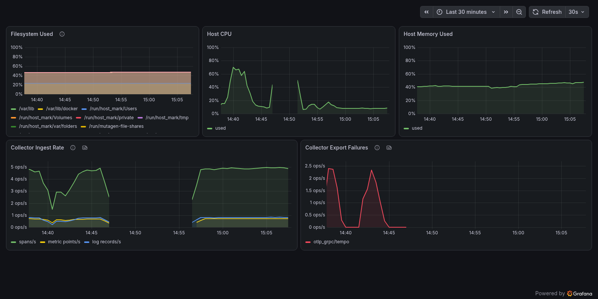

# Runbook

All commands run from the repo root on the monitoring host. Start with
`just ps` and the **Stack Health** dashboard; between them they answer most
"what is wrong" questions.



In that capture, the red export-failure spike is a Tempo outage and the
gap in the ingest panel is a backup/restore drill.

## A service is down or misbehaving

```sh
just ps                    # what's running, what's restarting
just logs <service>        # follow logs (otel-collector, loki, tempo, prometheus, grafana)
just restart <service>
```

Two alerts point here. `TargetDown` fires after two minutes when
Prometheus cannot scrape a target. Prometheus scrapes every service
(collector, node-exporter, Grafana, Loki, Tempo, and itself), so the alert
names whichever one went quiet. `OtelExportFailures` means the collector is up
but a backend is rejecting its data: read that backend's logs, not the
collector's.

## Disk filling up (`HostDiskSpaceLow`)

Retention is only partially size-bounded:

| Data | Time limit | Size limit |
| --- | --- | --- |
| Container stdout logs | none | json-file 10m × 3 per service |
| Prometheus TSDB | 30d | 15GB (`--storage.tsdb.retention.size`) |
| Loki chunks | 30d | none (Loki cannot cap total size) |
| Tempo blocks | 7d | none |

Loki and Tempo have no total-size knob, so the disk alert at 80% is the
backstop. Two earlier warnings sit in front of it: `HostDiskFilling` (a 6h
linear fit says a filesystem is full within 3 days) and
`PrometheusCardinalityHigh` (active series over 100k, ~7x the baseline;
series count, not time, is what grows the TSDB). When one fires, check the
Filesystem panel on Stack Health. Then
free space, or shorten a retention window and restart the affected service
(`retention_period` in `config/loki.yaml`, `block_retention` in
`config/tempo.yaml`, the `--storage.tsdb.retention.*` flags in
`compose.yml`). If disk pressure keeps returning, move Loki and Tempo to
object storage (see the appendix of ADR 0001).

Memory is bounded per service instead: every service carries a `mem_limit`
in `compose.yml`, sized from observed usage so one runaway component cannot
take the host down. Raise it there if a component legitimately grows into
its ceiling.

## Backup and restore

```sh
just backup                # pauses stateful services for seconds, writes backups/monitoring-<ts>.tar.gz
just restore backups/monitoring-<ts>.tar.gz   # stops the stack, wipes volumes, restores
just up
```

Backups are crash-consistent: restoring one is like recovering from a power
loss, which every component does cleanly via its write-ahead log. Notes:

- The tarball is mode 0600 and contains secrets (the Grafana database
  among them). Copy it off-host over a private channel: a backup on the
  disk it protects is a decoration.
- It covers the docker volumes and nothing else. The OpenTofu state for the
  Cloudflare edge is not in it (see below).
- During the pause the collector keeps accepting telemetry and buffers it
  for five minutes (`retry_on_failure.max_elapsed_time` on every exporter
  in `config/otel-collector.yaml`). The queue is file-backed, so
  restarting the collector inside that window keeps the buffer. A backup
  that runs longer than five minutes still drops data: on large volumes, run
  it at a quiet hour.

Worst-case loss equals the interval between backups. A daily cron on the
host is the intended setup.

## Rotating secrets

- **OTLP token:** set the new `OTLP_AUTH_TOKEN` in `.env`, run
  `docker compose up -d otel-collector`, then update every sender's
  `OTEL_EXPORTER_OTLP_HEADERS`. Senders still on the old token get 401s
  (export errors on their side) until updated. A running demo overlay counts
  as a sender: re-run `just demo` to recreate it with the new token.
  The token is shared, and the collector does not check `project`/`env`
  against the sender. Every project host is therefore trusted with every
  other project's telemetry identity. A compromised host could spoof another
  project's labels, and so quiet that project's silence alarm. Per-project
  tokens with a collector-side identity check are the upgrade if that trust
  ever stops being acceptable.
- **Tunnel token:** the tunnel is OpenTofu-managed, so read the token back
  from there, not from the dashboard. Rotate the tunnel secret in Cloudflare
  Zero Trust. Then run `cd infra && tofu apply`, which refreshes the token
  data source. Then read the new value with `tofu output -raw tunnel_token`.
  To rotate entirely from code instead, expect ingestion and Grafana to be
  unreachable for the minute or so it takes.
  `tofu apply -replace=cloudflare_zero_trust_tunnel_cloudflared.monitoring`
  builds a new tunnel and repoints both CNAMEs at it. Either way: new token
  into `CLOUDFLARE_TUNNEL_TOKEN` in `.env`, then `just up`.
- **Grafana admin password:** change `GRAFANA_ADMIN_PASSWORD` in `.env`,
  then `docker compose up -d grafana`.
- **Alert webhook and heartbeat URLs:** both are capability URLs, so the URL
  is the credential. Mint a new topic or check at the provider, put it in
  `ALERT_WEBHOOK_URL` / `HEARTBEAT_URL`, then `docker compose up -d grafana`;
  Grafana reads the contact points only at startup.
- **healthchecks.io API key:** regenerate it in the project's settings, set
  `HEALTHCHECKS_API_KEY` in `.env`. Only `bootstrap.sh` reads it, so nothing
  needs a restart.
- **Cloudflare API token:** it is never stored here; create a new one with the
  same three permissions, revoke the old one, export the new value before the
  next `tofu` run.

### Where every secret lives

Three files hold everything, all gitignored, none backed up by `just backup`.
Copy `.env` and `infra/terraform.tfstate` off-host together with the backups
and treat the copies the way you treat the originals.

| Secret | Lives in | Comes from |
| --- | --- | --- |
| `OTLP_AUTH_TOKEN` | `.env` | `openssl rand -hex 32` |
| `GRAFANA_ADMIN_PASSWORD` | `.env` | you |
| `ALERT_WEBHOOK_URL`, `HEARTBEAT_URL` | `.env` | the notification provider |
| `HEALTHCHECKS_API_KEY` | `.env` | healthchecks.io project settings |
| `CLOUDFLARE_TUNNEL_TOKEN` | `.env` | `tofu output -raw tunnel_token` |
| `CF_ACCESS_AUD` | `.env` (not secret, but paired) | `tofu output -raw grafana_access_aud` |
| Tunnel secret, API responses | `infra/terraform.tfstate` | written by every `tofu apply` |
| `CLOUDFLARE_API_TOKEN` | your shell, per session | Cloudflare dashboard |

`infra/terraform.tfvars` holds identifiers only (account, zone, domain, the
Access email list) and is gitignored for privacy, not because it holds a
credential.

## Alert delivery

Grafana evaluates and delivers the rules; there is no Alertmanager. Rules,
contact points and the routing tree are provisioned from
`config/grafana/alerting/`, so the UI shows them read-only: edit the YAML.
Two environment variables control where notifications go:

- `ALERT_WEBHOOK_URL` receives all alerts (any webhook: ntfy, Slack, …).
- `HEARTBEAT_URL` receives the always-firing `Watchdog` every five
  minutes. Point it at a dead man's switch (e.g. healthchecks.io) that
  raises the alarm when pings **stop**: that is the "monitoring host is
  dead" signal nothing inside the host can send.

Leaving them empty is not a safe default: delivery fails silently while the
heartbeat keeps pinging, so the switch reads healthy and every real alert is
dropped. With the tunnel overlay active, `just up` refuses to start without
`ALERT_WEBHOOK_URL`, and `AlertDeliveryFailing` fires on a failing notifier.

After changing either variable, run `docker compose up -d grafana`. A plain
`restart` silently keeps the old environment: compose rebuilds a container's
environment only on `up`.

## Changing the Cloudflare edge

The tunnel, its ingress rules, both DNS records, and the Cloudflare Access
policy that fronts Grafana are all OpenTofu in `infra/`. Change them there,
not in the Zero Trust dashboard: the next apply reverts anything clicked in
by hand.

```sh
just infra-validate                 # tofu init + validate, in a container
cd infra && tofu plan               # needs CLOUDFLARE_API_TOKEN exported
cd infra && tofu apply
```

- **Granting or revoking Grafana access:** edit `grafana_allowed_emails` in
  `infra/terraform.tfvars` and apply. That list is the entire allowlist. A
  removed address keeps working until their Access session expires (24h),
  so for an urgent revocation also revoke the session in Zero Trust. At
  least one address has to remain; the variable's validation rejects an empty
  list, which would lock everyone out. Before adding people, check your plan's
  Zero Trust seat limit in the Cloudflare dashboard. Cloudflare does not
  document the free-plan figure.
- **Per-user Grafana logins:** by default everyone who clears Access shares
  the one admin password. Set `GRAFANA_JWT_AUTH=true`,
  `CF_ACCESS_TEAM_DOMAIN=<team>`, and `CF_ACCESS_AUD` (from
  `tofu output -raw grafana_access_aud`) in `.env` to make Grafana verify the
  Access JWT instead: each address signs in as itself, and new ones land on
  the org's default role (Viewer). The aud pin is required because the JWK
  set is team-wide. Without it, a token minted for any other Access app in
  the team would be accepted here too. The `just up` exposure guards refuse
  to start JWT auth without both values.
- **Adding a hostname:** add an `ingress` entry pointing at the service's
  container port, plus a matching `cloudflare_dns_record`. The catch-all
  `http_status:404` entry stays last, or it swallows everything after it.
- **First apply against an edge built by hand** (a tunnel, DNS records, or
  Access app that already exist in the dashboard): an empty state plans them
  as "create", and applying that mints a second tunnel and a duplicate Access
  app. Run `infra/generate-imports.sh > infra/imports.tf` first, check the
  plan reads 0 to add for the imported resources, apply, then delete
  `imports.tf`; it is a one-time instruction and gitignored.
- **State lives on this host only, and it is a secret.** State stores the
  tunnel secret and every API response in plain text, so whoever can read it
  can run the tunnel. `infra/terraform.tfstate` is gitignored, and
  `just backup` does not touch it. Copy it off-host next to the backups, with
  the same care as `.env`. Losing it orphans the Cloudflare resources: they
  keep running, but the next apply creates duplicates, and recovery is
  `tofu import` by hand.

## Upgrading images

Dependabot opens PRs that bump the pinned versions, and CI runs
`just validate` and `just smoke` on each one. The validators (promtool, otelcol) read their image
versions from `compose.yml`, so every bump is checked with the exact
binaries the stack will run. A new version that changes its config syntax
fails CI before it reaches the host. Patch bumps arrive grouped, one PR for
the hub images and one for the spoke images; a minor or major comes on its
own, so a red PR names the one image that broke.

Dependabot also watches the Cloudflare provider in `infra/`. Those PRs need
one manual step: it bumps the constraint in `main.tf` but not the recorded
hashes in `.terraform.lock.hcl`. Check the branch out, run
`cd infra && tofu init -upgrade`, then `just infra-validate` and `tofu plan`
against the real account. Validation proves the syntax parses; only a plan
proves the provider still maps the config to the same resources.

Nothing watches the tool images pinned in the `justfile`: yamllint,
actionlint, shellcheck, ruff, gitleaks, OpenTofu, jq, the Alloy validator,
and the alpine that backup, restore, and the queue-volume setup run in. No
Dependabot ecosystem covers a justfile, so bump those by hand.

After merging, on the host: `git pull && just pull && just up`. Coming from
a release that still ran Alertmanager, its volume outlives the service:
`docker volume rm monitoring_alertmanager_data` once the new stack is up, and
`config/alertmanager.yaml` can go with it.

Use `just up`, not `docker compose up -d`. The recipe first chowns the
collector's queue volume to uid 10001. Where that volume is new, a raw compose
up leaves it root-owned and the collector crash-looping on a queue directory it
cannot write.
